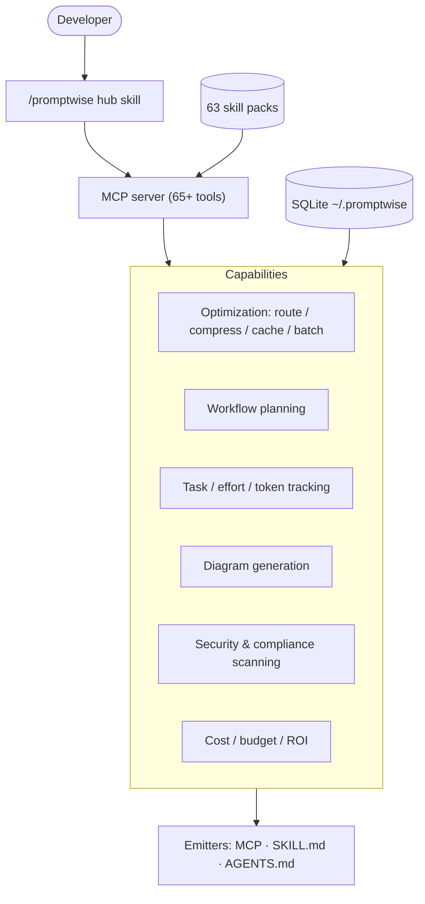
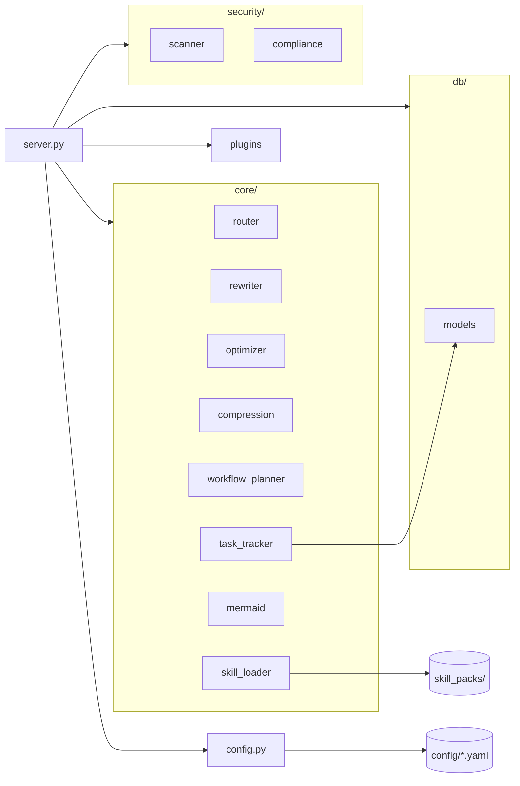
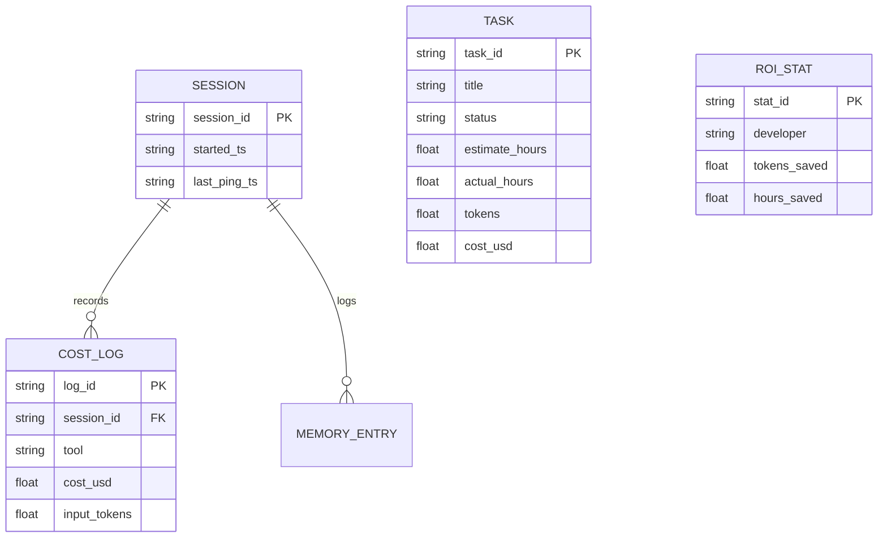
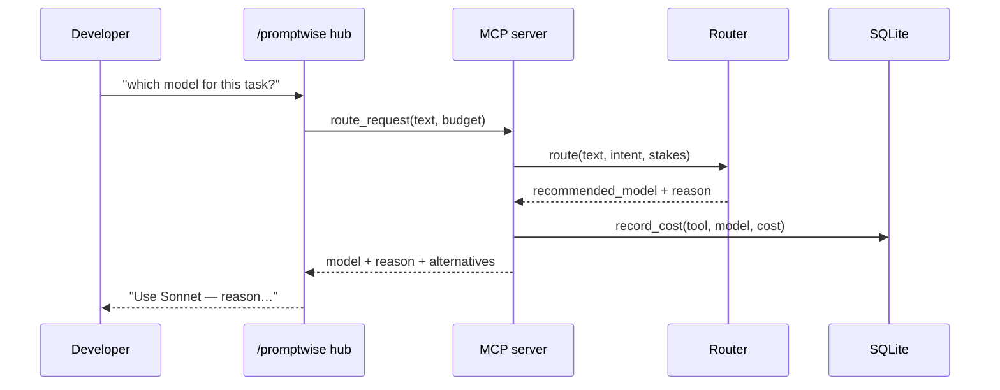

# PromptWise Architecture

Diagrams are Mermaid (plain text — render on GitHub). Generated with PromptWise's own
diagram skill packs and checked with `validate_mermaid`.

## Functional view

What PromptWise does and for whom — capabilities, not code.

## Technical view

Modules and dependencies inside `src/promptwise/`.

## Data model (ER)

Local SQLite schema (`db/models.py`).

## Request flow (sequence)

A `route_request` call from the agent.

