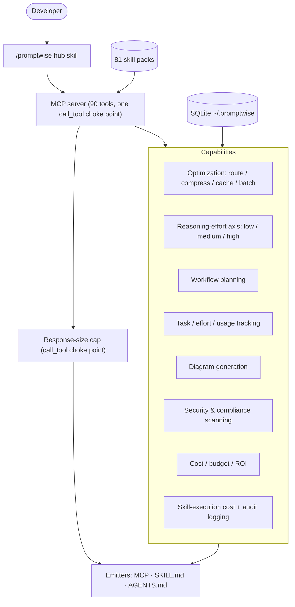
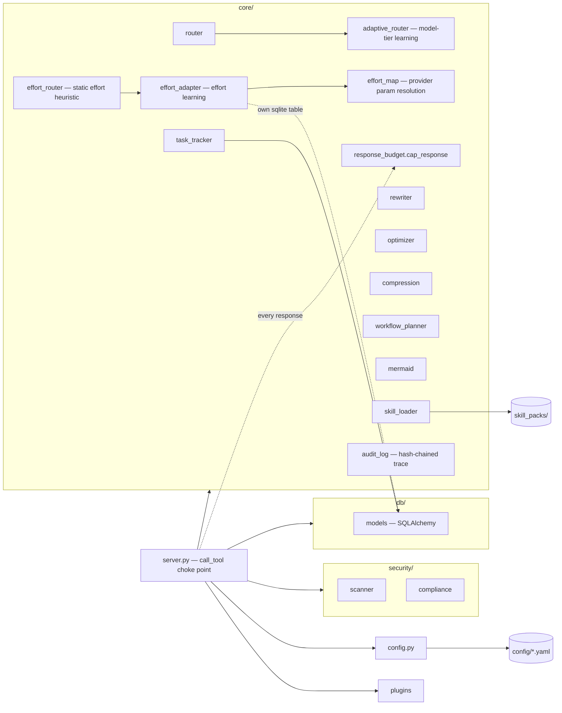
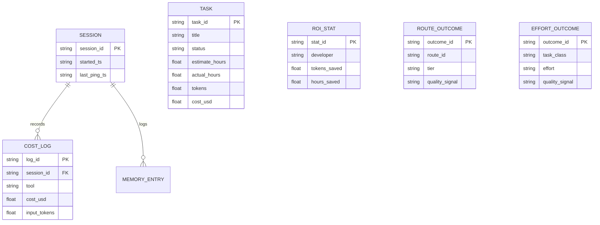
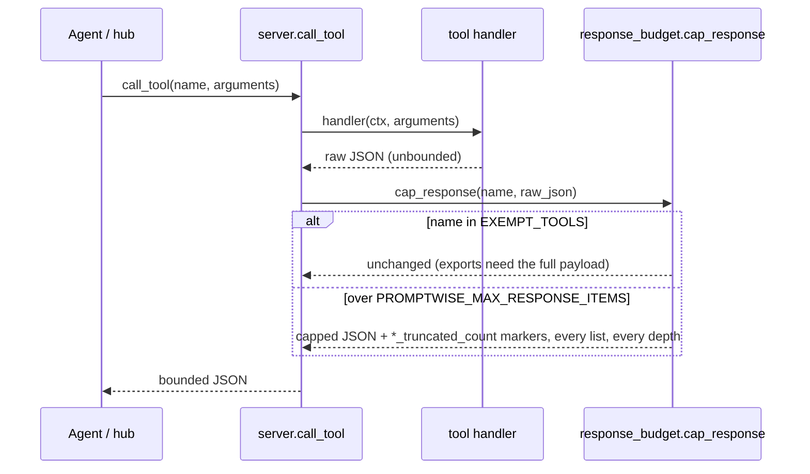
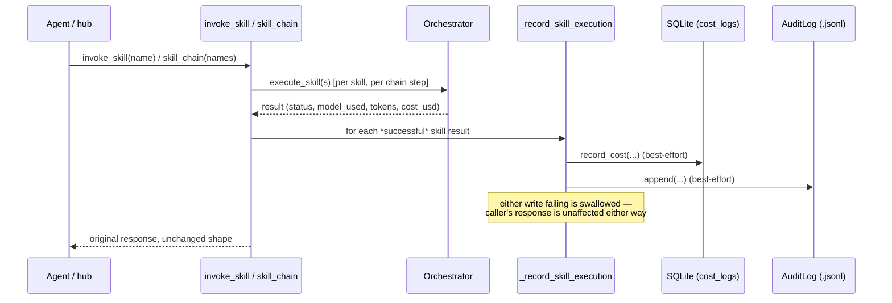

# PromptWise Architecture

Diagrams are Mermaid (plain text — render on GitHub). Generated with PromptWise's own
diagram skill packs and checked with `validate_mermaid`.

## Functional view

What PromptWise does and for whom — capabilities, not code.



Model tier (Haiku/Sonnet/Opus) and reasoning effort (low/medium/high) are two
**independent** axes — a request gets both a model recommendation and an effort
level; neither implies the other. Both axes share the same outcome-learning
design: a static heuristic first, then an optional Beta-posterior adapter that
blends in past outcomes once enough samples exist, fail-open to the static pick
on any error.

## Technical view

Modules and dependencies inside `src/promptwise/`.



`response_budget.cap_response` is the single place every tool's JSON response
passes through before returning to the caller — one generic recursive walker
caps any over-limit list at any nesting depth (top-level, dict value, or list
item), with a small exempt set (`export_audit`, `get_sbom`, …) where the full
payload is the point.

## Data model (ER)

Local SQLite schema (`db/models.py`, SQLAlchemy) plus one standalone table
(`effort_outcomes`, raw sqlite3, own connection — created lazily by
`effort_adapter.py`, same database file, independent of the ORM).



`ROUTE_OUTCOME` (model tier) and `EFFORT_OUTCOME` (reasoning effort) feed the
two independent learning adapters — same Beta-posterior/minimum-sample design,
different ladder (Haiku→Sonnet→Opus vs. low→medium→high). Absence of history
is neutral, never negative; both adapters fail open to the static pick.

The hash-chained audit trail (`audit_log.py`) is a separate append-only
`.jsonl` file, not a database table — deliberately outside the SQLite store so
the trace survives independently of it.

## Request flow (sequence)

A `route_request` call from the agent — model tier and reasoning effort are
resolved together, each independently, both fail-open to their static pick.

```mermaid
sequenceDiagram
  participant U as Developer
  participant H as /promptwise hub
  participant M as MCP server
  participant R as Router
  participant EA as EffortAdapter
  participant D as SQLite
  U->>H: "which model, how much effort?"
  H->>M: route_request(text, budget)
  M->>R: route(text, intent, stakes)
  R-->>M: recommended_model + reason (+ adaptive blend from ROUTE_OUTCOME)
  M->>EA: _resolve_effort(intent, stakes)
  EA-->>M: effort (static, or adapted from EFFORT_OUTCOME; fail-open on error)
  M->>D: record_cost(tool, model, cost)
  M-->>H: model + effort + reason + alternatives
  H-->>U: "Use Sonnet, medium effort — reason…"
```

## Response cap (sequence)

Every tool response passes through one choke point before it reaches the
caller, regardless of shape or nesting depth.



## Skill invocation audit (sequence)

`invoke_skill` / `skill_chain` already computed real per-call cost and model
data; it was never persisted before this pass. Logging is additive and
fail-open — a logging failure never changes what the caller gets back.


