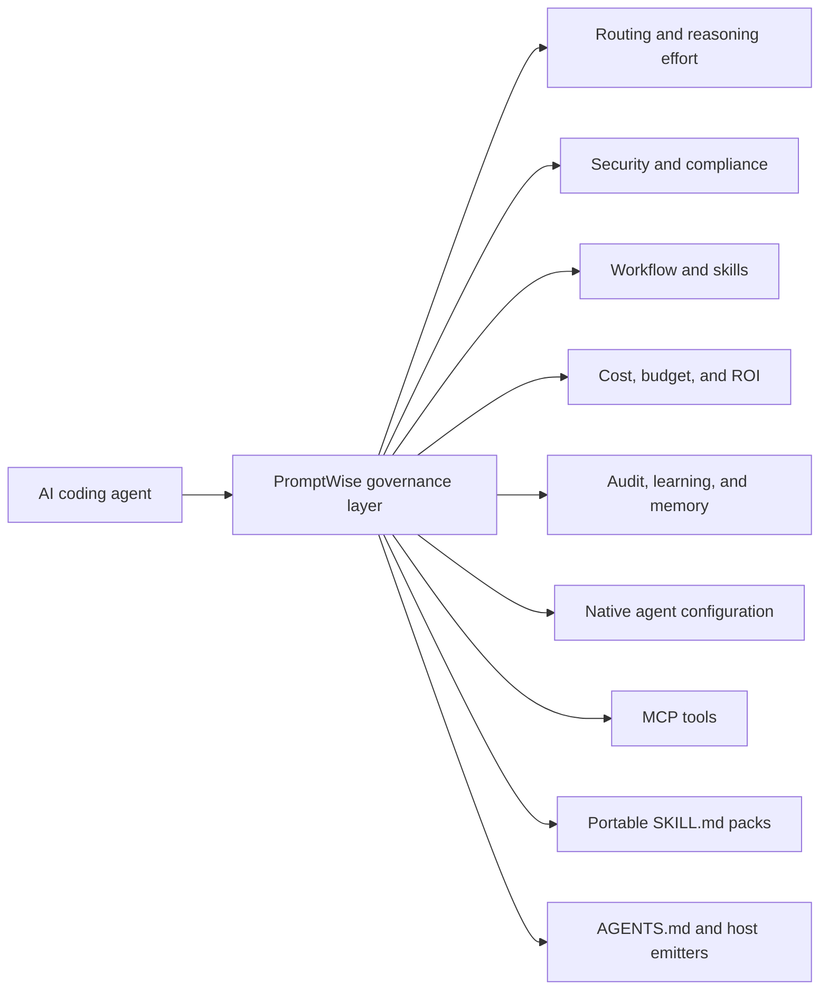
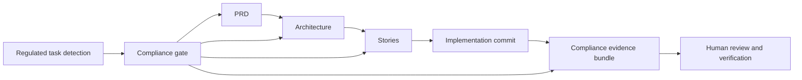
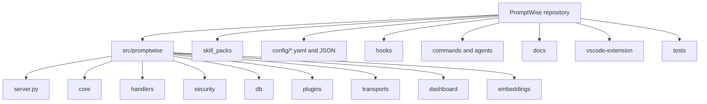
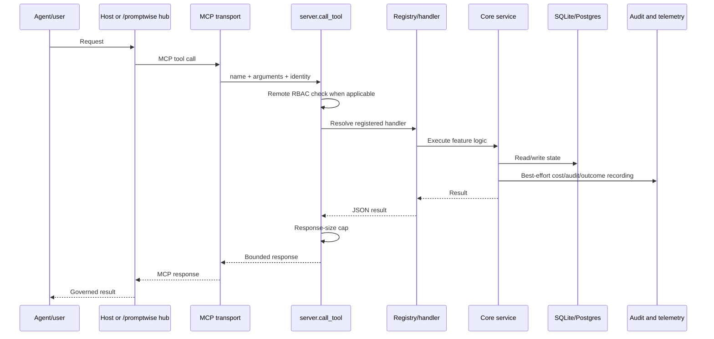
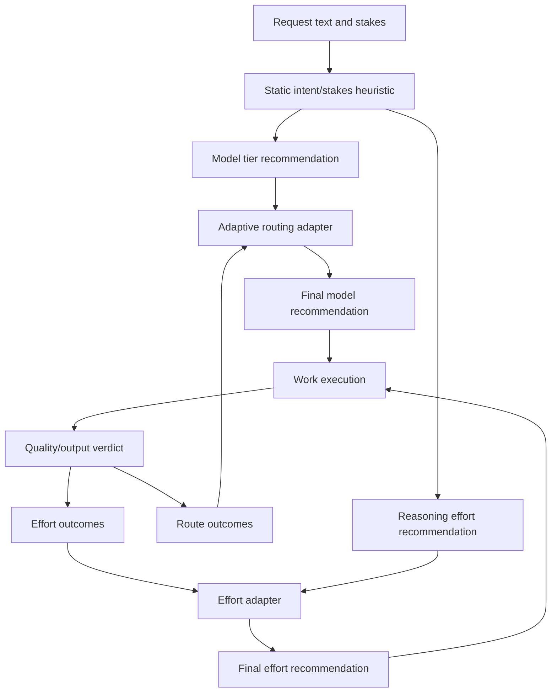
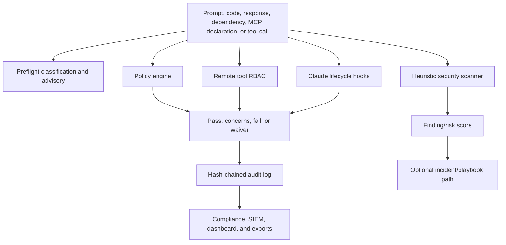
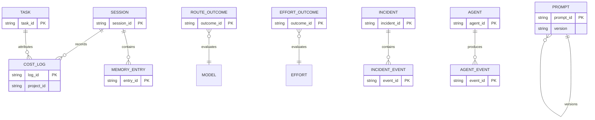
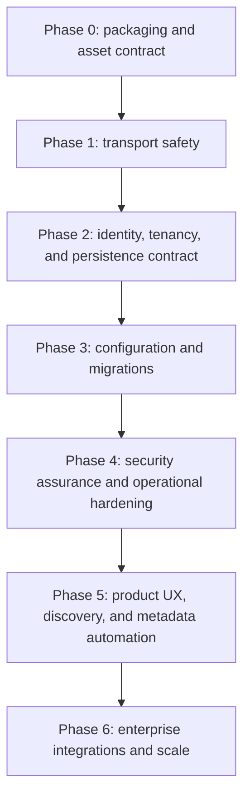
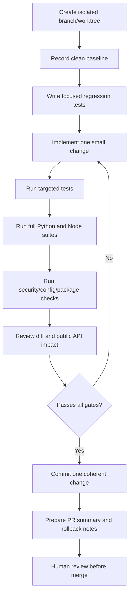

# PromptWise Product Vision and Codebase Review

**Review type:** non-mutating product, architecture, codebase, security, packaging,
documentation, and integration review  
**Review date:** 2026-09-04  
**Repository:** PromptWise v1.10.0  
**Purpose:** preserve the current vision, findings, gaps, and enhancement backlog for
later implementation planning. This document does not implement any recommendation.

## 1. Executive conclusion

PromptWise has a credible and differentiated product direction: a local-first
governance and intelligence layer that sits beside AI coding agents and compiles one
governance source into MCP tools, portable SKILL.md packs, and native agent guidance.
Its strongest themes are model/cost routing, workflow governance, security scanning,
auditability, portability, and responsible-AI controls.

The project is feature-rich and test-rich, but the scope has grown faster than the
operational foundation. The main risks before calling the product production-ready are:

1. installed-package and runtime asset discovery;
2. unsafe and unreliable CLI transport behavior;
3. hardening of remote HTTP deployment;
4. incomplete tenant/project isolation and inconsistent shared-database support;
5. weak configuration validation;
6. manually maintained product metadata and documentation drift.

The system is best described today as a strong beta governance toolkit for local or
trusted single-team use, rather than a fully hardened multi-tenant governance platform.

## 2. Product goal and vision

### 2.1 Stated product goal

PromptWise is intended to be **the governance and intelligence layer for AI agents**.
It is a conductor, not a replacement for Claude Code, Codex, Cursor, Copilot, Gemini,
Windsurf, JetBrains AI Assistant, Cline, Aider, Goose, OpenHands, or other MCP hosts.

The core product idea is:



### 2.2 Product pillars

| Pillar | Intended value |
|---|---|
| Model routing | Select an appropriate model tier based on task type, stakes, budget, and learned outcomes. |
| Reasoning-effort routing | Select low, medium, or high effort independently from model tier. |
| Context engineering | Compress, cache, batch, summarize, rank, and hand off context. |
| Role intelligence | Detect roles and recommend role/technique skills. |
| Skill packs | Provide portable, agent-neutral workflows through SKILL.md files. |
| Workflow planning | Turn a request into an ordered PRD, architecture, story, test, review, and verification chain. |
| Security | Scan prompts, code, responses, dependencies, MCP declarations, and agent behavior. |
| Compliance | Produce auditable evidence chains for regulated work. |
| Runtime governance | Use lifecycle hooks, policies, budgets, JIT permissions, and quality gates. |
| Learning | Record outcomes, corrections, techniques, and reusable knowledge. |
| Portability | Emit one governance source into multiple agent-native formats. |
| FinOps | Track tokens, costs, budgets, savings, ROI, and provider usage. |
| Operations | Offer local dashboard, remote MCP, OIDC-ready dashboard flows, SIEM, and telemetry. |

### 2.3 Constitution and compliance promise

Regulated work is required to preserve an auditable artifact chain:



`plan_workflow` is intended to flag regulated tasks, add the security-architecture
pack, and include OWASP/SBOM checks. Compliance output is advisory evidence and should
not be represented as legal, regulatory, or certification approval.

## 3. Current architecture

### 3.1 Repository architecture



### 3.2 Runtime request flow



### 3.3 Tool registration flow

```mermaid
flowchart LR
    M[handlers/*.py] --> Decorator[@tool decorator]
    Decorator --> Registry[ToolRegistry]
    Registry --> Definitions[_TOOL_DEFS]
    Registry --> Handlers[_HANDLERS]
    Definitions --> List[tools/list]
    Handlers --> Call[call_tool]
    Call --> Cap[response_budget.cap_response]
```

The decorator-based registry is a good architectural improvement over a monolithic
dispatch function. Registration order is currently treated as a golden-snapshot
contract, which protects compatibility but adds maintenance coupling.

### 3.4 Routing and learning flow



### 3.5 Security and governance flow



### 3.6 Persistence model

The primary persistence target is local SQLite at `~/.promptwise/promptwise.db`, with
JSONL audit output and project-local `.promptwise/` operational state. Optional
Postgres support exists for some SQLAlchemy paths.



## 4. Complete skill-pack inventory

The repository currently contains **84 Markdown skill-pack files**, grouped as follows.
The `.promptwise` directory is runtime state, not a skill family.

### Agile — 9

- `agile-analyst` — discovery brief covering goals, users, constraints, and risks.
- `agile-architect` — system/solution architecture, data flow, technical decisions, and NFRs.
- `agile-dev` — implementation of one self-contained story using embedded context.
- `agile-orchestrator` — route phases/personas and preserve the compliance gate.
- `agile-pm` — convert a brief into PRD, requirements, epics, and stories.
- `agile-po` — validate cohesion and shard work into story context.
- `agile-qa` — risk-profile stories, design tests, assess NFRs, and issue quality gates.
- `agile-sm` — create implementation-ready stories with embedded architecture context.
- `agile-ux` — optional UX/front-end specification for UI stories.

### AI — 14

- `agent-chain-designer` — multi-agent workflow and dependency design.
- `bias-check` — advisory review for biased or loaded language.
- `compact-guard` — preserve critical state across context compaction.
- `few-shot-builder` — create diverse few-shot examples.
- `groundedness-check` — identify unsupported or fabricated claims.
- `llm-council` — stakes-aware multi-model deliberation with dissent.
- `model-migration-advisor` — adapt prompts/features between providers.
- `multi-model-eval` — compare quality, cost, and latency across models.
- `prompt-registry` — save, tag, search, and version system prompts.
- `rag-optimizer` — analyze retrieval configuration and quality.
- `responsible-ai` — end-of-turn grounding, fairness, and disclosure review.
- `system-prompt-auditor` — inspect loopholes, conflicts, and injection exposure.
- `thoroughness` — enumerate work and prevent silent omissions.
- `token-efficiency` — reduce token spend through caching, compression, batching, and delegation.

### Development — 13

- `code-optimizer` — performance, complexity, hot-path, memory, and query optimization.
- `code-review` — correctness, style, complexity, security, and coverage review.
- `design-patterns` — recommend patterns and explain trade-offs.
- `deslop` — remove filler, redundant comments, and AI-generated ceremony.
- `feature-dev` — brainstorm, TDD, review, and verification workflow.
- `finishing-branch` — prepare PR descriptions and final validation.
- `git-workflow` — commits, branches, PRs, and merge-conflict guidance.
- `refactoring` — characterization tests and incremental safe refactoring.
- `solution-scaffold` — classify a build and produce options, spec, and diagram.
- `systematic-debugging` — reproduce, isolate, hypothesize, and verify.
- `tdd` — test-first implementation workflow.
- `verification-before-completion` — tests, TODOs, docs, and security completion checklist.

### DevOps — 3

- `cicd-generator` — generate CI/CD configurations.
- `iac-assistant` — generate/refactor Terraform and CloudFormation.
- `incident-response` — analyze logs, RCA, and runbook recommendations.

### Diagrams — 4

- `architecture-diagram` — functional and technical Mermaid architecture diagrams.
- `er-diagram` — Mermaid entity-relationship diagrams.
- `flow-diagram` — Mermaid process/control/data-flow diagrams.
- `sequence-diagram` — Mermaid interaction, async, loop, and branch diagrams.

### Documentation — 11

- `adr` — MADR architecture decision records.
- `api-docs` — OpenAPI 3.1 generation from routes.
- `architecture-review` — coupling, cohesion, scalability, and separation review.
- `brd-generator` — business requirements documents.
- `changelog-generator` — human-readable release changelogs from git.
- `enterprise-architecture` — TOGAF, Zachman, ArchiMate, C4, capability maps, and NFR templates.
- `prd-generator` — PRDs with stories, metrics, and feature breakdowns.
- `security-architecture` — STRIDE threat modeling.
- `solution-architecture` — C4 context/container architecture and trade-offs.
- `system-design` — C4 blueprints, trade-off matrices, and Mermaid diagrams.
- `user-story-generator` — stories with Gherkin or plain-English acceptance criteria.

### Industry — 19

- `ai-roi-report` — usage, cost, and ROI reports.
- `aml-checker` — anti-money-laundering pipeline review.
- `banking` — FINRA, Basel III, PCI-DSS, AML, and reconciliation review.
- `csuite` — executive ROI summaries and board decks.
- `data` — SQL, ETL, and model-card-oriented data engineering guidance.
- `fhir-validator` — FHIR structure and HL7 pipeline compliance.
- `finra-compliance` — FINRA Rule 3110 review.
- `gdpr-assessor` — GDPR Article 25 privacy-by-design review.
- `healthcare` — HIPAA, PHI, FHIR, and FDA-related review.
- `hipaa-checker` — Safe Harbor identifier redaction and HIPAA review.
- `hr` — job descriptions, performance reviews, and DEI bias checks.
- `jd-generator` — DEI-neutral job descriptions and seniority calibration.
- `legal` — GDPR, CCPA, contracts, and IP risk review.
- `ml-model-card` — intended use, limitations, data, and bias metrics.
- `qa` — defect triage, automation strategy, and test matrices.
- `reconciliation-gen` — financial ledger reconciliation scripts.
- `security-ops` — threat modeling, incident response, and SOC2 review.
- `sql-optimizer` — query, index, and schema optimization.
- `threat-modeler` — STRIDE application threat modeling and attack trees.

### Security — 6

- `eu-ai-act-readiness` — EU AI Act readiness and signed evidence bundle guidance.
- `license-compliance` — dependency license and copyleft review.
- `nhi-audit` — OWASP non-human identity fleet audit.
- `owasp-checker` — OWASP code checks including SQLi, XSS, SSRF, IDOR, and auth.
- `sbom-generator` — CycloneDX/SPDX SBOM generation.
- `secrets-rotation-advisor` — secret detection and rotation migration advice.

### Testing — 5

- `api-testing` — API integration test generation from OpenAPI.
- `e2e-test-designer` — Playwright/Page Object Model E2E blueprints.
- `test-coverage-advisor` — identify critical uncovered paths.
- `test-data-generator` — realistic PII-safe fixtures.
- `test-generator` — unit and integration test generation.

## 5. Findings and issues

Severity definitions:

- **P0:** release-blocking or security-critical.
- **P1:** high-impact production or trust problem.
- **P2:** important quality, maintainability, or product problem.
- **P3:** polish, documentation, or future enhancement.

### P0 — installed package cannot reliably locate runtime assets

**Evidence:** `pyproject.toml` finds only packages under `src`; configuration, skill
packs, corpus data, hooks, and most plugin assets live outside the Python package.
`server.py` derives the repository root from source layout, while `config.py` defaults
to `parents[1]` (`src`).

**Impact:** editable checkout execution can work while wheel installation, global CLI
execution, or execution from another working directory may silently load defaults,
find zero skill packs, miss compliance files, or fail to find credentials.

**Required enhancement:** establish a supported asset-resolution contract:

1. package default assets under `promptwise/data/` or explicitly include them as package data;
2. support an explicit config/data root override;
3. distinguish installed defaults, user state, and target project state;
4. add clean-machine wheel tests from a directory outside the repository;
5. make missing assets visible through `doctor`, not silent fallback.

### P1 — CLI transport command injection and lifecycle defect

`CLIAdapter` invokes configured commands with `shell=True`. It also uses
`process.communicate()` while retaining the process object for later calls.

**Impact:** command injection risk for untrusted endpoint configuration; subsequent
requests may fail because `communicate()` closes stdin and waits for process exit.

**Required enhancement:** use argument vectors and `shell=False`; use a persistent
line-oriented protocol or create a fresh process per request; add tests for multiple
calls, timeout cleanup, stderr handling, process crashes, and hostile endpoint strings.

### P1 — remote HTTP transport is not production hardened

The Streamable HTTP transport authenticates bearer tokens and protects session reuse,
but lacks built-in TLS, rate limiting, body-size limits, connection quotas, session TTL,
and cleanup of `_session_owners`.

**Impact:** plaintext credential exposure on non-loopback binds, memory growth from
session creation, and denial-of-service exposure.

**Required enhancement:** add bounded request/session resources, expiration, cleanup,
per-token quotas, trusted-host validation, operational metrics, and an explicit refusal
or warning for non-loopback plaintext operation. Keep reverse-proxy deployment support,
but make insecure deployment difficult to overlook.

### P1 — multi-tenant/project isolation is incomplete

`Identity.projects` exists but is explicitly not enforced. Several raw SQLite stores
continue to use `get_db_path()` even when shared Postgres is configured.

**Impact:** team users may see one another's cost, memory, audit, fleet, incident,
learning, or security state; some features may show stale/local data while others use
Postgres.

**Required enhancement:** define tenant/project ownership for every entity; propagate
identity through every handler; enforce filters in repositories; make all stores use a
common persistence interface; add cross-user isolation tests and shared-database tests.

### P1 — configuration validation is too permissive

YAML parsing catches errors broadly and returns defaults. Semantic types, ranges,
allowed values, and boolean coercion are not consistently validated.

**Impact:** malformed deployments can appear healthy while silently operating with
defaults or partially loaded settings.

**Required enhancement:** use Pydantic or JSON Schema for configuration; validate model
references, paths, roles, budgets, thresholds, ports, and security modes; expose a
configuration error report from `doctor` and startup logs.

### P1 — security controls are heuristic and fail-open

The scanner is regex/heuristic-based. Hooks intentionally return success on errors.
This supports availability but means the hooks are not a reliable security boundary.

**Impact:** false negatives remain possible, while product language may imply stronger
enforcement than is technically provided.

**Required enhancement:** clearly separate advisory detection from mandatory blocking;
add CI integration with established SAST, secret, dependency, and license scanners;
publish precision/recall benchmarks and safe failure semantics per control.

### P2 — audit trail is tamper-evident but not tamper-resistant

The SHA-256 hash chain detects edits but local operators can delete or replace the
JSONL file. Retention defaults to unbounded local storage.

**Required enhancement:** signed checkpoints, append-only remote sink, rotation and
retention policies, chain verification on startup, and explicit export/import integrity
metadata.

### P2 — shared database support is only partial

Postgres support exists in core SQLAlchemy paths, while multiple raw SQLite stores are
documented as intentionally local. This is an understandable phase decision, but it
must be visible in capability reporting.

**Required enhancement:** expose a capability matrix showing which features are local,
shared, or isolated; either complete the migration or rename shared mode as partial.

### P2 — model and pricing freshness is not sufficiently governed

The configuration's verification date is older than the review date. Model aliases and
pricing are data-driven but still require manual maintenance.

**Required enhancement:** stale-registry warnings, provider/model validation, pricing
effective dates, deprecation handling, and a deterministic offline registry update path.

### P2 — tool registration order is an unnecessary compatibility constraint

The handler split is cleaner, but preserving exact registration order through repeated
`_add_handler_module` calls and golden snapshots creates coupling for future work.

**Required enhancement:** give tools stable IDs or sort deterministically for exposure;
test set equality and schema compatibility separately from order unless a host truly
requires order.

### P2 — response caps can conflict with complete exports

The generic response cap protects callers, but exemptions create an unbounded-response
class and truncation can remove useful records if callers do not inspect markers.

**Required enhancement:** pagination/cursors, explicit export-file references, response
size in bytes/tokens as well as item count, and mandatory truncation metadata.

### P2 — process-wide mutable state complicates concurrency

Examples include lazy global audit objects, in-memory HTTP session ownership, and
process-wide registries. SQLite access is spread across async SQLAlchemy and synchronous
connections.

**Required enhancement:** define lifecycle ownership, connection pooling rules, locking
policy, shutdown cleanup, and concurrency tests with multiple workers/processes.

### P3 — documentation and metadata drift

Observed inconsistencies include:

| Source | Claim |
|---|---:|
| README/plugin docs | 83 skill packs, 1539 tests, 142 tools |
| Repository scan | 84 skill-pack Markdown files, 1526 test functions, 142 decorators |
| `pyproject.toml` description | 81 skill packs |
| `SECURITY.md` | latest version listed as 1.9.x |
| Package/plugin metadata | 1.10.0 |
| Historical roadmap docs | older 84/90-tool counts |

**Required enhancement:** generate counts and version references from the registry and
filesystem; add a CI metadata consistency check; update or archive historical claims.

### P3 — repository text contains encoding/mojibake artifacts

Many displayed files contain sequences such as `—`, `→`, and `×` instead of their
intended Unicode characters.

**Required enhancement:** normalize repository files to UTF-8, configure editor/CI
encoding explicitly, and add a documentation encoding check.

### P3 — dashboard browser output should remain centrally escaped

The VS Code panel tests cover escaping, but the Flask dashboard renders several values
through JavaScript template strings and `innerHTML`.

**Required enhancement:** prefer DOM text APIs or a single trusted escaping utility;
add XSS regression tests for every dashboard data field.

## 6. Product and architecture gaps

### 6.1 Identity and access

- OAuth 2.1/dynamic client registration for third-party MCP connectors is deferred.
- OIDC exists for dashboard login but not as a complete remote MCP identity solution.
- Static bearer tokens need rotation, revocation, expiry, and audit-friendly lifecycle.
- Project scopes exist in the identity model but are not enforced.
- Viewer/admin roles are coarse for a 142-tool surface.

### 6.2 Enterprise operations

- No built-in TLS termination.
- No rate limiting or connection quotas.
- Partial Postgres adoption.
- No formal migration/versioning framework for the growing schema.
- No complete backup/restore procedure for SQLite, audit, and project state.
- No clear HA or horizontal scaling model.

### 6.3 Security assurance

- Heuristic scanner coverage needs measured precision/recall by detector.
- Dependency trust uses a bundled popular-package corpus that needs update governance.
- Network-enabled checks need egress policy, proxy support, and audit records.
- Audit signing and external immutable retention are not default.
- Hook fail-open behavior needs explicit risk acceptance per deployment profile.

### 6.4 Product usability

- 142 tools and 84 packs create discovery overload.
- A recommended “golden path” for common tasks should be more prominent than the full surface.
- Capability availability should be shown when optional dependencies or assets are missing.
- Errors should distinguish unavailable, denied, degraded, and failed states.
- Dashboard and CLI should expose the same metrics and semantics.

### 6.5 Quality and delivery

- Python tests could not be run in the review environment because no Python interpreter was installed.
- The VS Code extension ran 26 tests: 24 passed and 2 were skipped because Python was unavailable.
- CI currently runs import smoke tests and pytest but does not visibly cover clean wheel installation, remote TLS deployment, multi-process HTTP behavior, or all optional extras.
- The VS Code test run reports a Node module-type warning; package metadata should declare the intended module type.

## 7. Recommended implementation planning sequence

This is a planning recommendation only; no implementation was performed during this
review.



Suggested gates:

1. **Distribution gate:** build a wheel, install it outside the checkout, start the
   server, load skills, load compliance data, and run `doctor`.
2. **Transport gate:** prove shell-free CLI execution, repeated calls, bounded HTTP
   resources, session expiry, and secure deployment warnings.
3. **Tenant gate:** two identities must not see each other's scoped data; every store
   must have a declared local/shared/tenant behavior.
4. **Configuration gate:** invalid config must fail clearly or report degradation.
5. **Security gate:** benchmark detectors, verify audit integrity, and document fail-open
   residual risk.
6. **Release gate:** generate tool/pack/test/version metadata automatically and run all
   Python, Node, packaging, and integration checks.

## 8. Codex compatibility assessment

### 8.1 Evidence that Codex integration is present

The repository includes:

- root `AGENTS.md` with project context and constitution;
- `docs/integration/CODEX.md` integration guidance;
- Codex support in the configuration emitter;
- project-scoped `.codex/config.toml` synchronization logic;
- MCP server registration using `python -m promptwise.server` and `PYTHONPATH=src`;
- Codex listed among supported agents in the README;
- tests named `test_codex_mcp_sync.py` and related emitter tests.

The current conversation also confirms that Codex can read the supplied project
instructions and inspect the repository. That proves instruction-level compatibility.

### 8.2 What could be verified in this environment

The VS Code extension's MCP integration tests attempted to launch the real server but
were skipped because `python` is not installed in this environment. Therefore, a full
end-to-end Codex MCP call could not be executed here.

### 8.3 Current conclusion

**PromptWise is designed and configured to work with Codex, but end-to-end runtime
compatibility is not proven by this review environment.** The static integration
surface is present; the main risk is the packaging/path issue described above.

### 8.4 Required Codex verification procedure

On a machine with Python 3.10–3.12:

```text
1. Create a clean checkout or install the built wheel outside the repository.
2. Run the Codex bootstrap/sync command for AGENTS.md and .codex/config.toml.
3. Confirm the generated MCP entry points to the intended Python interpreter.
4. Start the MCP server from a directory other than the repository root.
5. Ask Codex to list PromptWise tools.
6. Call list_skills and confirm all 84 packs are discoverable.
7. Call route_request, security_check, and plan_workflow.
8. Confirm SQLite/audit state is written to the intended user/project locations.
9. Repeat using a non-editable wheel installation.
10. Verify that a missing optional dependency produces a clear degraded capability.
```

## 9. Source files reviewed

- `README.md`
- `AGENTS.md`
- `pyproject.toml`
- `src/promptwise/server.py`
- `src/promptwise/config.py`
- `src/promptwise/core/`
- `src/promptwise/handlers/`
- `src/promptwise/security/`
- `src/promptwise/db/`
- `src/promptwise/transports/`
- `src/promptwise/dashboard/`
- `hooks/`
- `config/`
- `skill_packs/`
- `tests/`
- `vscode-extension/`
- `docs/ARCHITECTURE.md`
- `docs/OPS_REMOTE_MCP.md`
- `docs/OPS_SHARED_IDENTITY.md`
- `docs/integration/CODEX.md`
- `.claude-plugin/`
- `.github/workflows/`

## 10. Review status

- No implementation files were changed.
- No configuration files were changed.
- No findings were removed or downgraded.
- Python tests were not executable because Python is unavailable in the current environment.
- VS Code tests completed with 24 passes and 2 environment-related skips.
- This document is intended to be the baseline for the next PRD/architecture and
  implementation-planning session.

## 11. Integration test report: Codex and other agents

### 11.1 Environment setup result

The requested backend test could not be completed in this execution environment:

- `python`, `python3`, `py`, `uv`, and `poetry` are not available.
- No installed Python interpreter was found under the checked Windows Python path.
- The MCP server therefore cannot start from `.mcp.json`, the Claude plugin manifest,
  or the VS Code MCP client.
- No API keys were supplied, so no external Codex/OpenAI or Gemini network test was
  attempted.

The repository's JSON configuration files do parse successfully with Node:

- `.mcp.json` — valid JSON;
- `.claude-plugin/plugin.json` — valid JSON;
- `.claude-plugin/marketplace.json` — valid JSON;
- `vscode-extension/package.json` — valid JSON.

The root `.mcp.json` is configured with `command: python`, `-m promptwise.server`,
`cwd: ${projectDir}`, `PYTHONPATH: ${projectDir}/src`, and 23 `alwaysAllow` tools.
That setup is appropriate for an editable checkout with Python available, but does not
solve the packaged-install asset problem described earlier.

### 11.2 VS Code/MCP client tests

`npm test` completed:

- 24 tests passed;
- 2 real-server tests were skipped because `python -m promptwise.server` could not be
  launched;
- the mocked panel/view-model tests passed;
- Node emitted a module-type warning because `package.json` does not declare the
  intended module type.

The two skipped tests are specifically the real MCP checks for listing tools and
calling `get_budget_status`. Consequently, the most important end-to-end path remains
unverified here.

### 11.3 Codex integration findings

There are two different Codex integration concepts in the repository:

1. **Codex as an MCP host:** this is structurally present. The emitter writes a
   project-scoped `.codex/config.toml`, Codex is mapped to `AGENTS.md`, and tests cover
   configuration generation and idempotence.
2. **Codex as a model/provider adapter:** this is only a partial local stub.

The actual implementation is `promptwise.transports.create_adapter`, not
`promptwise.adapters`. The current Codex adapter in `transports/http.py`:

- requires `CODEX_API_KEY` but does not use it to make an OpenAI request;
- returns a keyword-based recommendation for `route_request`;
- returns hard-coded comparison data for `compare_providers`;
- returns a local string rewrite for `rewrite_prompt`;
- returns `tool_not_supported_on_codex` for other tools;
- reports `health_check()` as true without checking a provider.

The documented examples in `docs/integration/CODEX.md` and other integration guides
use `from promptwise.adapters import create_adapter`, but no `promptwise/adapters.py`
or `promptwise/adapters/` package exists. The Codex guide also references
`promptwise.core.codex_output_validator.CodexOutputValidator` and
`promptwise.core.auto_role_applier.AutoRoleApplier`, neither of which exists in the
current source tree.

**Codex conclusion:** Codex MCP-host configuration is likely usable after a real
Python installation and clean runtime test. The documented provider/API integration is
not currently executable as written and should be classified as incomplete/stub-level.

### 11.4 Other agent integration findings

| Agent/platform | Static integration surface | Runtime verification here | Current assessment |
|---|---|---|---|
| Claude Code | Plugin manifest, hooks, MCP config, commands, agents | Not run; Python unavailable | Strongest integration surface, backend still unverified |
| Codex | `AGENTS.md`, emitter, `.codex/config.toml` sync, MCP registration | Config tests are present; live server skipped | Host integration designed; live compatibility unproven |
| Cursor | Native emitter and detector support | No live Cursor host available | Static portability only |
| Copilot | Native guidance emitter/profile | No live Copilot host available | Static portability only |
| Gemini CLI | Native emitter and MCP-related configuration | No live Gemini CLI host available | Static portability only |
| Windsurf | Native emitter/profile | No live Windsurf host available | Static portability only |
| JetBrains AI | Native emitter/profile | No live IDE available | Static portability only |
| Cline | Native emitter/profile | No live extension available | Static portability only |
| Aider | `CONVENTIONS.md` emitter | No live Aider process available | Static portability only |
| Goose | `.goosehints` emitter | No live Goose process available | Static portability only |
| OpenHands | Microagent/repository guidance emitter | No live OpenHands process available | Static portability only |
| Antigravity | Project MCP config emitter and CLI adapter | No live endpoint available | Configuration exists; adapter uses shell execution and needs real protocol testing |
| Generic MCP host | `.mcp.json` and standard MCP server | Real server skipped | Protocol design is plausible; runtime not proven |

The portability tests validate generated files and detector behavior, not whether each
third-party agent actually loads, interprets, and obeys the generated configuration.
Those are separate acceptance tests and should not be conflated.

### 11.5 Required agent compatibility test matrix

For each supported agent, the future test plan should verify:

1. clean installation and interpreter discovery;
2. generated native configuration placement;
3. MCP server startup from outside the repository;
4. `tools/list` discovery;
5. at least one read-only and one governed tool call;
6. skill-pack discovery and invocation;
7. response shape and truncation behavior;
8. audit/cost persistence;
9. denied or malformed tool-call behavior;
10. restart, timeout, and missing-optional-dependency behavior.

For Codex specifically, add separate tests for MCP-host mode and provider-adapter mode;
they currently represent different capabilities and should have different documentation
and acceptance criteria.

## 12. Requirements for proper support across AI coding agents

### 12.1 Define the support contract first

“Works with all agents” must be split into explicit support levels. A native rules file
being generated is not the same as an agent starting the MCP server, discovering tools,
invoking skills, and enforcing governance.

| Level | Meaning | Acceptance evidence |
|---|---|---|
| L0 — Documentation | Setup instructions exist and are accurate. | Fresh-user setup walkthrough passes. |
| L1 — Native guidance | Agent reads generated rules/skills. | Native file detected and loaded in a real host session. |
| L2 — MCP tools | Agent starts PromptWise and discovers/calls tools. | `tools/list`, read-only call, governed call, and error call pass. |
| L3 — Governance | Security, policy, budgets, audit, and workflow behavior works in that host. | End-to-end acceptance suite and audit evidence pass. |
| L4 — Provider adapter | PromptWise makes real provider calls and reports real results/costs. | Live API integration with mocked and live-contract tests. |
| L5 — Enterprise | Identity, tenancy, shared persistence, telemetry, and deployment controls work. | Multi-user, failure, security, and operational tests pass. |

The current project is closest to L1/L2 for MCP-compatible hosts, L3 for selected
local/Claude hook paths, and below L4 for the documented Codex/Gemini provider adapters.

### 12.2 Common prerequisites

Every supported integration needs:

1. Python 3.10, 3.11, or 3.12;
2. PromptWise installed with `pip install -e .` for development, or from a validated
   wheel/sdist for distribution testing;
3. runtime dependencies installed from `pyproject.toml`;
4. a stable absolute PromptWise checkout or packaged asset directory;
5. `config/promptwise.yaml`, `config/models.yaml`, compliance files, and skill packs;
6. a writable runtime directory for `~/.promptwise/` and project `.promptwise/` state;
7. a defined Python interpreter path in every host integration;
8. no secrets committed to repository configuration;
9. a configured agent-native rules file generated from the canonical governance bundle;
10. a test project outside the PromptWise repository to prove path independence.

Optional capabilities require separate prerequisites:

| Capability | Additional requirement |
|---|---|
| Local embeddings | `promptwise[embeddings]`; model download once, then local inference. |
| LDAP identity | `promptwise[ldap]`, domain connectivity, valid Kerberos/GSSAPI ticket. |
| Shared Postgres | `asyncpg`, reachable Postgres, schema initialization, backup policy. |
| Remote MCP | Static bearer credentials, TLS reverse proxy, quotas, operational monitoring. |
| OIDC dashboard | Authlib, issuer/client/secret/redirect settings, strong Flask secret key. |
| Provider calls | Provider SDK/API credentials, model registry, egress policy, cost limits. |
| VS Code panel | Node/npm, extension build, Python server available to configured interpreter. |

### 12.3 Canonical installation and configuration

#### Local checkout setup

```bash
git clone <PromptWise-repository>
cd PromptWise
python -m venv .venv
. .venv/bin/activate                 # Windows: .venv\\Scripts\\Activate.ps1
python -m pip install --upgrade pip
python -m pip install -e ".[dev]"
```

Verify the checkout before connecting an agent:

```bash
python -m promptwise doctor --json
PYTHONPATH=src python -c "import promptwise.server as s; print(len(s._TOOL_DEFS))"
PYTHONPATH=src python -c "from pathlib import Path; from promptwise.core import SkillLoader; x=SkillLoader(Path('skill_packs')); x.load_skills(); print(len(x.skills))"
```

The current `INSTALL.md` says to expect 113 tools and 81 packs, while the current
repository review found 142 registered tools and 84 skill-pack files. This must be
resolved before publishing a canonical setup guide.

#### Recommended configuration rules

- Use absolute paths in host configuration when possible.
- Keep `config/promptwise.yaml` as non-secret defaults only.
- Store tokens, API keys, database credentials, and OIDC secrets in environment
  variables or a secrets manager.
- Set an explicit budget and provider allowlist before enabling live calls.
- Set security scanning and audit options intentionally; record any fail-open risk.
- Keep `skill_packs/` and generated native rules synchronized using `sync_agent_config`.
- Run `check_portability` after adding or changing packs, commands, or agents.
- Use a separate test database and audit path for integration testing.

#### Canonical MCP entry

For an editable checkout, the common MCP shape is:

```json
{
  "mcpServers": {
    "promptwise": {
      "command": "/absolute/path/to/PromptWise/.venv/bin/python",
      "args": ["-m", "promptwise.server"],
      "cwd": "/absolute/path/to/PromptWise",
      "env": {
        "PYTHONPATH": "/absolute/path/to/PromptWise/src"
      }
    }
  }
}
```

On Windows, use the absolute path to `.venv\\Scripts\\python.exe`. The host must be
able to start this command with no interactive shell prompt. The final packaged design
should eliminate the need for `PYTHONPATH` and repository-relative assets.

### 12.4 Agent-by-agent setup requirements

#### Claude Code

Required:

- install the plugin or register `.mcp.json`;
- ensure the hook runner can execute the configured Python interpreter;
- ensure `${CLAUDE_PLUGIN_ROOT}` points to a checkout containing `hooks/`, `config/`,
  and `skill_packs/`;
- review and intentionally enable fail-open lifecycle hooks;
- verify `/mcp`, `/promptwise`, hook events, audit output, and permission prompts.

Expected support: strongest native integration because the repository includes a plugin
manifest, commands, agents, MCP registration, and lifecycle hooks. Still requires a
clean-machine test with the actual Claude Code runtime.

#### Codex

Required:

- Codex must read `AGENTS.md` from the project hierarchy;
- `.codex/config.toml` must contain a valid `mcp_servers.promptwise` entry;
- the configured command must resolve to a working Python interpreter;
- the MCP server must start from the project directory and discover all tools;
- generated AGENTS content must stay below the Codex context/file-size budget;
- use `AGENTS.override.md` only for intentional local overrides;
- test both repository guidance loading and MCP tool access.

Current limitation: the repository’s documented provider adapter examples use a
nonexistent `promptwise.adapters` import and nonexistent helper classes. The actual
module is `promptwise.transports`. Its Codex implementation is a local stub and does
not make OpenAI API calls. Codex host support and Codex provider support must therefore
be treated as separate workstreams.

#### Cursor

Required:

- generate `.cursor/rules/promptwise.mdc`;
- preserve valid YAML frontmatter, `description`, `globs`, and `alwaysApply` values;
- choose an activation mode appropriate for token budget;
- verify Cursor actually loads the rule and does not truncate critical governance text;
- register the same MCP server in Cursor’s MCP settings if tool access is required.

Expected support: native rule generation and MCP compatibility; no runtime Cursor test
is currently present.

#### GitHub Copilot

Required:

- generate `.github/copilot-instructions.md`;
- optionally generate `.github/instructions/*.instructions.md` with valid `applyTo`;
- verify repository instructions are loaded by the specific Copilot surface in use;
- configure MCP separately where supported by the selected IDE/extension;
- test that scoped rules do not conflict with global instructions.

Expected support: static instruction generation is present; actual Copilot behavior is
host/version dependent and needs a live IDE or CLI acceptance test.

#### Gemini CLI

Required:

- generate `GEMINI.md` at the correct project level;
- configure MCP according to the installed Gemini CLI version;
- verify nested instruction precedence and prompt-size behavior;
- test tool discovery and skill-pack portability separately.

Current limitation: the Gemini provider adapter returns a placeholder “supported”
response and does not call Gemini. Native guidance and provider execution must not be
claimed as one capability.

#### Windsurf

Required:

- generate `.windsurfrules` in the location Cascade actually reads;
- verify the file is loaded for the workspace and does not exceed practical context;
- configure MCP in Windsurf separately;
- test rule precedence against existing workspace/global rules.

#### JetBrains AI Assistant

Required:

- generate `.aiassistant/rules/promptwise.md`;
- configure the rule type/activation in IDE settings, because it is not encoded solely
  in the Markdown file;
- verify project scope, model scope, and file-pattern scope;
- configure and test MCP support for the installed JetBrains product/version.

#### Cline

Required:

- generate `.clinerules`;
- verify workspace loading and rule precedence;
- configure MCP server entry in Cline settings;
- test that destructive operations still go through the host’s confirmation model.

#### Aider

Required:

- generate `CONVENTIONS.md`;
- add `read: CONVENTIONS.md` to `.aider.conf.yml` or pass `--read CONVENTIONS.md`;
- configure MCP only if the selected Aider version/integration supports it;
- verify the file is actually read, since Aider does not necessarily auto-load it.

#### Goose

Required:

- generate `.goosehints` at repository root;
- verify Goose’s project traversal and hint loading;
- register the MCP server using Goose’s current configuration format;
- test tool calls and rule application independently.

#### OpenHands

Required:

- generate `.openhands/microagents/repo.md`;
- verify repository microagent discovery;
- configure MCP in the OpenHands runtime;
- test that repository guidance does not override security-critical system policy.

#### Antigravity

Required:

- generate `.agents/mcp_config.json`;
- provide a valid endpoint for the CLI adapter if using provider/CLI mode;
- test command parsing, process lifetime, timeout, stderr, and repeated calls;
- remove shell interpretation before accepting untrusted endpoint configuration.

Current limitation: the transport adapter uses `shell=True` and needs a security and
protocol review before production use.

#### Generic MCP hosts and web agents

Required:

- use the standard MCP server entry with a host-supported transport;
- validate tool schemas and text response shape;
- use `export_web_bundle` for web agents where no MCP or filesystem integration exists;
- treat web bundles as static context, not runtime enforcement.

### 12.5 Native emitter support matrix

| Agent | Emitter target | Format | Automatic runtime enforcement |
|---|---|---|---|
| Claude Code | `CLAUDE.md` plus plugin/hooks | Markdown/MCP/hooks | Yes, through Claude lifecycle hooks |
| Codex | `AGENTS.md` plus `.codex/config.toml` | Markdown/TOML/MCP | No host hook layer currently shown |
| Cursor | `.cursor/rules/promptwise.mdc` | MDC/YAML frontmatter | Host-dependent |
| Copilot | `.github/copilot-instructions.md` and scoped instructions | Markdown/frontmatter | Host-dependent |
| Gemini | `GEMINI.md` | Markdown | Host-dependent |
| Windsurf | `.windsurfrules` | Markdown | Host-dependent |
| JetBrains | `.aiassistant/rules/promptwise.md` | Markdown + IDE settings | Host-dependent |
| Cline | `.clinerules` | Markdown | Host-dependent |
| Aider | `CONVENTIONS.md` | Markdown + explicit read config | Host-dependent |
| Goose | `.goosehints` | Markdown | Host-dependent |
| OpenHands | `.openhands/microagents/repo.md` | Markdown | Host-dependent |
| Antigravity | `.agents/mcp_config.json` | JSON/MCP | Host-dependent |
| Grok | Existing Claude/AGENTS surface | Native file reuse | Host-dependent |

The emitter should be treated as a compilation target. Each target needs a versioned
profile containing path, format, size limit, activation semantics, hierarchy,
imports, and MCP registration behavior.

## 13. Implementation plan

This plan is intentionally not executed in this review.

### Phase 0 — establish the support contract and metadata source

**Deliverables:**

- define L0–L5 support levels;
- create one machine-readable agent capability registry;
- generate tool count, pack count, supported-host list, and version references;
- correct stale setup docs and remove nonexistent API examples;
- add a compatibility matrix to `doctor` and documentation.

**Exit criteria:** every claim in README, INSTALL, integration docs, plugin metadata,
and review documents agrees with generated repository facts.

### Phase 1 — make distribution and asset discovery reliable

**Deliverables:**

- package default configs, skill metadata, compliance data, and corpus assets;
- define precedence: package defaults → user config → project config → environment;
- remove source-tree `parents[]` assumptions;
- support explicit config/data paths;
- make CLI and server behavior identical from any working directory;
- add wheel/sdist clean-install tests.

**Exit criteria:** a wheel installed outside the checkout starts, loads skills, loads
compliance rules, exposes tools, and writes state to the documented locations.

### Phase 2 — complete MCP host integration

**Deliverables:**

- validate MCP schemas and lifecycle behavior against the current SDK;
- provide host-specific setup/diagnostics;
- test `tools/list`, representative calls, errors, response caps, and shutdown;
- add a real Codex MCP acceptance test;
- add an automated `.mcp.json`/`.codex/config.toml` smoke harness.

**Exit criteria:** Codex and at least one generic MCP host pass L2 from a clean install.

### Phase 3 — make native emitters host-correct

**Deliverables:**

- validate each emitted format with host-specific parsers where available;
- add activation, hierarchy, size, and scoping checks;
- verify Aider explicit read behavior and JetBrains activation settings;
- provide safe preview/diff/apply workflows;
- add per-host manual acceptance checklists and fixtures.

**Exit criteria:** every listed emitter passes syntax, placement, size, idempotence, and
real-host loading tests or is downgraded to documentation-only support.

### Phase 4 — repair provider adapters

**Deliverables:**

- decide whether provider adapters are in product scope;
- replace nonexistent `promptwise.adapters` documentation;
- implement real provider clients behind explicit network/API configuration;
- use current provider model IDs and capabilities;
- record real token usage, cost, latency, errors, retries, and rate limits;
- provide mocked contract tests and opt-in live smoke tests;
- remove false-positive `health_check()` implementations.

**Exit criteria:** Codex and Gemini provider modes either work against their APIs with
auditable results or are clearly removed from the supported product promise.

### Phase 5 — security and transport hardening

**Deliverables:**

- remove `shell=True`;
- fix CLI process lifecycle and timeout cleanup;
- add HTTP request/session bounds, rate limiting, TTL, and cleanup;
- add TLS deployment safeguards and trusted-host checks;
- add token expiry, rotation, revocation, and audit events;
- add security regression tests for transport and web output.

**Exit criteria:** remote mode has documented, tested safe defaults and a threat model
covering credential exposure, session hijacking, resource exhaustion, and command injection.

### Phase 6 — tenancy, persistence, and enterprise readiness

**Deliverables:**

- unify SQLAlchemy and raw-store persistence behind a repository abstraction;
- implement project/tenant identity filters;
- add schema migration/version management;
- decide which state is local versus shared;
- add backup, restore, retention, audit export, and disaster-recovery procedures;
- test multi-user Postgres and failure fallback behavior.

**Exit criteria:** shared mode has a published data-isolation model and passes two-user
cross-visibility tests.

### Phase 7 — observability and release quality

**Deliverables:**

- standardize structured logs, metrics, traces, and correlation IDs;
- add performance/load tests for tool calls, skill loading, audit, and HTTP;
- add CI jobs for Python versions, wheel installation, optional extras, Node build,
  metadata consistency, security scans, and representative live-host fixtures;
- normalize UTF-8 documentation and remove mojibake;
- publish release notes with verified tool/pack/host counts.

**Exit criteria:** release artifacts are reproducible, claims are generated, and all
support levels have evidence.

### Phase 8 — usability and adoption

**Deliverables:**

- expose curated workflows above the full 142-tool surface;
- add first-run setup wizard/doctor guidance;
- show missing capability reasons and optional dependency status;
- make bundle generation and synchronization easy to preview and undo;
- provide per-agent troubleshooting playbooks.

**Exit criteria:** a new user can install, connect one MCP host, generate native rules,
run a governed workflow, and understand failures without reading internal plans.

## 14. Final planning recommendation

The first implementation cycle should focus on **truthful, repeatable interoperability**
rather than adding more tools or skill packs. The recommended order is:


The key decision for the next planning session is whether PromptWise is primarily:

1. a host-neutral MCP governance server;
2. a cross-agent native-guidance compiler;
3. a multi-provider LLM routing proxy; or
4. an enterprise governance platform.

It can eventually be all four, but each has different security, operational, testing,
and support requirements. The current codebase is strongest in the first two and should
complete those contracts before promising the latter two.

## 15. What is required before implementation begins

### 15.1 Required authorization and decisions

The product vision and implementation direction are sufficiently clear to begin. The
following operational authorization is still required before modifying implementation
files:

1. explicit approval to create a working branch and edit source/tests/configuration;
2. permission to run local tests and build commands;
3. confirmation that no direct push to `main` is allowed during autonomous work;
4. confirmation of the first milestone, with **Phase 0 — packaging and asset
   resolution** recommended as the default;
5. confirmation of the supported Python versions for the first release gate;
6. confirmation that public API/tool behavior must remain backward-compatible unless a
   deprecation plan is documented.

No production credentials, API keys, private URLs, or deployment access are required for
the first milestones. Live provider tests should use mocked contracts and opt-in local
environment variables; secrets must never be placed in source, tests, logs, or generated
artifacts.

### 15.2 Environment prerequisites

The current review environment does not have Python installed. Before backend work can
be validated, provide or install:

```text
Python 3.10, 3.11, or 3.12
pip and venv
Node/npm for the VS Code extension
Git with branch/worktree support
```

Recommended local setup:

```bash
python -m venv .venv
# Windows: .venv\\Scripts\\Activate.ps1
# macOS/Linux: source .venv/bin/activate
python -m pip install --upgrade pip
python -m pip install -e ".[dev]"
```

The first baseline commands should be:

```bash
python -m pytest tests -q
python -m pytest --collect-only -q
python -m promptwise doctor --json
cd vscode-extension && npm test
```

If the baseline is not green, the failures must be classified as pre-existing before
new implementation starts. The baseline result, interpreter version, dependency
versions, and git commit must be recorded in the implementation log.

### 15.3 Safe autonomous development protocol

The implementation should follow this control loop:



Safety rules:

- never work directly on `main`;
- never force-push or rewrite public history;
- never use destructive reset/checkout commands to discard user work;
- preserve unrelated existing changes;
- use small commits that can be reverted independently;
- add a regression test before changing behavior;
- keep existing tool names, schemas, response envelopes, and default behavior stable;
- add new behavior behind opt-in flags when compatibility is uncertain;
- do not change public configuration defaults without migration notes;
- do not add network calls to offline paths;
- do not introduce secrets into fixtures or logs;
- update documentation and version metadata in the same release-oriented change;
- stop and request direction if a change requires breaking an external contract,
  changing compliance semantics, or modifying production deployment state.

### 15.4 Branch and commit model

Recommended branch sequence:

```text
main
  └── feature/phase0-packaging-assets
        ├── test: clean-install asset discovery
        ├── feat: explicit config/data resolution
        ├── test: wheel and sdist startup
        └── docs: installation and compatibility corrections
```

Each commit should contain one coherent behavior change. A pull request should include:

- problem statement and scope;
- files changed;
- compatibility impact;
- test commands and results;
- security impact;
- migration/configuration impact;
- rollback procedure;
- explicit list of deferred findings.

### 15.5 First implementation milestone

The safest first milestone is **Phase 0: distribution and asset resolution**.

Scope:

1. inventory all runtime assets required by server, CLI, hooks, skills, compliance,
   corpus, dashboard, and emitters;
2. define package defaults versus project overrides versus user state;
3. add a supported explicit config/data-root mechanism;
4. remove source-layout and current-working-directory assumptions;
5. keep editable-checkout behavior backward-compatible;
6. add clean wheel/sdist installation tests;
7. update `INSTALL.md`, `CONFIGURATION.md`, and integration docs;
8. generate correct tool/skill counts instead of hard-coded claims;
9. add `doctor` diagnostics for missing or mismatched assets;
10. verify Codex and generic MCP startup from outside the checkout.

Non-goals for the first milestone:

- no tool redesign;
- no database migration;
- no provider API implementation;
- no remote transport behavior change;
- no changes to existing security policy semantics;
- no direct deployment or public-branch mutation.

### 15.6 Subsequent milestones

After Phase 0 passes, proceed in this order:

| Milestone | Focus | Release protection |
|---|---|---|
| 1 | Package/assets and clean installation | Wheel/sdist smoke tests from outside checkout |
| 2 | MCP host compatibility | Codex, generic MCP, Claude, and representative host tests |
| 3 | Native emitter correctness | Format, size, placement, idempotence, and real-host checks |
| 4 | Provider adapters | Mocked API contracts, real opt-in smoke tests, accurate health/cost reporting |
| 5 | CLI/HTTP hardening | Shell-free commands, limits, TTL, rate controls, auth lifecycle |
| 6 | Tenancy/persistence | Cross-user isolation, migrations, shared/local capability matrix |
| 7 | Release quality | CI matrix, metadata generation, security scans, rollback documentation |

### 15.7 Definition of safe completion

An implementation milestone is complete only when:

- all new tests pass;
- the pre-existing test baseline has not regressed;
- public MCP tool names/schemas remain compatible or are versioned;
- the feature works from a clean installation where applicable;
- security and failure modes are documented;
- configuration migration is documented;
- audit and cost behavior is verified;
- the diff contains no secrets or unrelated edits;
- a rollback path is written;
- the change is committed on a non-main branch;
- a human reviews and approves the pull request before merge.

### 15.8 Decision needed to start

The minimum start decision is:

> Approve autonomous implementation of Phase 0 on a new feature branch, with no direct
> push to `main`, backward compatibility preserved, tests required for every change,
> and human review required before merge.

If approved, the first execution should be environment setup and baseline capture,
followed by a written Phase 0 design note before source changes are made.

## 16. Environment setup and live MCP verification

### 16.1 Setup completed

Python 3.12.0 was found at:

```text
C:\Users\ANIL\AppData\Local\Programs\Python\Python312\python.exe
```

A project virtual environment was created at `.venv/`. PromptWise was installed in
editable mode with development dependencies, and Ruff 0.16.6 was installed because the
existing static-analysis tests require the `ruff` executable but the repository's
`.[dev]` dependency group does not currently declare it.

### 16.2 Backend verification

Successful checks:

- PromptWise server import: passed;
- registered MCP tools: 142;
- skills loaded from `skill_packs/`: 83;
- `promptwise doctor --json`: 7/7 checks passed;
- full Python suite: passed after making Ruff available to the test process;
- VS Code/Node suite: 24 passed, 2 real-server tests skipped before Python was installed.

The Python suite initially reported three static-analysis failures because Ruff was not
installed. After Ruff installation, the same suite passed. This identifies a development
environment/dependency declaration gap rather than a failing static-analysis assertion.

### 16.3 Real MCP round-trip verification

Using the VS Code MCP client against the actual server process with the absolute virtual
environment interpreter:

```text
MCP tool discovery: 142 tools
get_budget_status: passed
route_request: passed with isolated writable database
security_check: passed
plan_workflow for HIPAA patient portal: passed; compliance workflow selected
```

The first `route_request` attempt against the existing user database failed with
`sqlite3.OperationalError: attempt to write a readonly database`. Re-running with a
temporary writable `PROMPTWISE_DB_URL` succeeded. The existing user database itself is
not marked read-only at the Windows file-attribute level; this should be investigated as
an ACL/managed-workspace or SQLite directory-permission issue before normal operation is
declared reliable.

The temporary integration database was removed after the test. No source or tracked
configuration was changed by the verification.

### 16.4 Current verified readiness

The local MCP server is operational in this environment when launched with the explicit
`.venv\\Scripts\\python.exe` interpreter and a writable database location. The following
remain unverified or incomplete:

- `python` and `py -3.12` are not available in the already-running shell process;
- a fresh terminal is needed to confirm the user PATH update;
- the existing default user database write-permission issue needs resolution;
- live Codex/OpenAI and Gemini provider calls are not implemented by the current adapters;
- real Claude Code, Codex, Cursor, Gemini, Copilot, Windsurf, JetBrains, Cline, Aider,
  Goose, OpenHands, and Antigravity host sessions were not all available for testing;
- Ruff should be added to the project development dependencies or its tests should
  explicitly document the external tool prerequisite.

## 17. Phase 0 implementation record (feature branch)

Implementation is being performed on `feature/phase0-packaging-assets`; `main` is not
modified and no push is performed by the agent.

### 17.1 Asset-discovery contract

PromptWise now centralizes runtime asset lookup in `promptwise.asset_paths`:

```text
explicit caller path/root
        │
        ├── PROMPTWISE_CONFIG_DIR (configuration directory override)
        ├── PROMPTWISE_ROOT (checkout/runtime root override)
        ├── checkout root discovered from cwd and package location
        └── promptwise/_assets (wheel/sdist bundled fallback)
```

The resolver covers `config/`, `skill_packs/`, and `corpus/`. A checkout remains the
highest-priority source so local configuration and corpus changes retain their existing
behavior. An installed wheel no longer depends on the caller's cwd or on repository
files outside `site-packages`. Explicit paths continue to win, which preserves test,
operator, and tenant-specific overrides.

### 17.2 Packaging changes

The package now includes a copy of the runtime `config`, `skill_packs`, and `corpus`
trees under `src/promptwise/_assets/`, declared through setuptools package data. The
validated wheel contains 115 asset files, including 84 skill markdown files and the
default injection corpus. This makes the default MCP server, model registry, RBAC
configuration, security corpus, and skill loader usable from an installed package.

Default paths in the config, model registry, external pricing, RBAC, responsible-AI,
alerts, scheduler, embeddings, model-refresh, dependency-guard, and injection-benchmark
components now use the shared resolver. `SkillLoader()` can also be constructed without
a path and will discover the configured/default portable skill directory.

### 17.3 Regression coverage and remaining verification

`tests/test_asset_paths.py` verifies packaged assets, arbitrary cwd execution, explicit
root overrides, and explicit config-directory compatibility. Targeted asset/config/skill
tests pass, and the complete Python suite passes when Ruff is available. Ruff is now in
the `.[dev]` dependency group so a fresh development install supplies the executable.

Wheel and sdist validation passed. The wheel and source distribution both contain the
bundled config, skill markdown, and corpus assets; an installed-wheel subprocess test
loaded the config and 83 runtime skills from an unrelated working directory. The Node /
VS Code suite also passes (24 passed, 2 pre-existing environment-dependent real-server
tests skipped because the test process resolves `python` rather than the installed
`.venv` interpreter). No public API or MCP tool name is intentionally changed.
