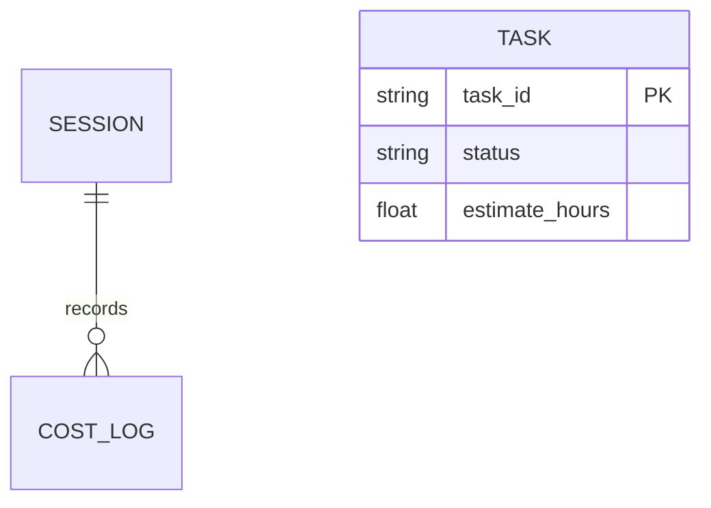

# PromptWise User Guide

A practical walkthrough: install, drive the `/promptwise` hub, work with the 72 skill
packs, and real examples for routing, diagrams, task tracking, the governed agile method,
and security. The local engine runs without API keys or third-party tools (executing a
skill's prompt via `invoke_skill` uses your configured model).

- Install: [INSTALL.md](../INSTALL.md)
- Configure: [CONFIGURATION.md](../CONFIGURATION.md)
- Architecture + diagrams: [ARCHITECTURE.md](ARCHITECTURE.md)

---

## 1. Quick install

```bash
git clone https://github.com/u2anilgit/PromptWise.git
cd PromptWise
pip install -e .
```

Claude Code:
```bash
claude marketplace add ./
claude plugin install promptwise
```
Restart, run `/mcp` to confirm the `promptwise` tools, then `/promptwise`.

Any other MCP host: point it at the bundled `.mcp.json` (see INSTALL.md).

---

## 2. The `/promptwise` hub

`/promptwise` (no argument) prints the full menu grouped by purpose: Optimization,
Workflow planning, Task tracker, Diagrams, Roles & skill packs, Security & compliance,
Cost/budget/ROI, Session/memory/config.

You don't need to memorize tool names — **describe the goal** and the hub routes to the
right tool. Examples that auto-trigger: "which model should I use", "this prompt is too
long", "draw the architecture", "track effort on this task", "scan this code".

---

## 3. Working with skill packs

72 portable `SKILL.md` packs live in `skill_packs/`, grouped by category: `agile/`, `ai/`,
`dev/`, `devops/`, `diagrams/`, `docs/`, `industry/`, `security/`, `testing/`.

Tools to use them:

| Tool | Use |
|------|-----|
| `list_skills` | See every pack |
| `suggest_skill` | "what pack fits this request?" |
| `invoke_skill` | Run one pack (e.g. `tdd`, `banking`, `er-diagram`) |
| `skill_chain` | Run several in order |

Packs are portable — copy them into another agent and they just work:
```bash
cp -r skill_packs/* ~/.codex/skills/        # or .cursor/skills/ , ~/.gemini/skills/
```

Add your own: drop a `SKILL.md` into `skill_packs/<category>/` with frontmatter
(`name`, `description`, `triggers`); it loads on next start or `reload_config`.

---

## 4. Real examples

### a. Pick the right model
> "Which model for: extract dates from 200 invoices? Budget-conscious."

Calls `route_request` → returns a tier (likely Haiku), the reasoning, estimated cost, and
cheaper alternatives. Add a monthly budget and it factors burn rate in.

### b. Tighten a bloated prompt
> "Compress this 600-word prompt." → `compress_prompt` (caveman) or `rewrite_prompt`
> (filler removal + role framing). For a long pasted doc → `optimize_context` to a token
> budget.

### c. Plan a build (PromptWise-native workflow)
> "How should I structure a HIPAA patient portal?"

`plan_workflow` →
```
greenfield-build+compliance  (compliance_gate: true)
detect_role → security-architecture → prd-generator → system-design →
user-story-generator → tdd → code-review → verification-before-completion →
owasp_scan → get_sbom
```
Each step is a PromptWise pack/tool you run via `invoke_skill`.

### d. Generate a diagram
> "Draw the ER diagram for these models." → `invoke_skill er-diagram` → Mermaid out →
> `validate_mermaid` confirms it renders.



### e. Track effort, tokens, and cost
```
add_task    title="Build login" estimate_hours=4 status=in_progress
update_task task_id=<id> status=done actual_hours=5 add_tokens=1200 add_cost=0.03
task_report
```
`task_report` → estimate-vs-actual variance, token totals, cost, completion %.

### f. Security & compliance pass
> "Scan this code before I run it." → `security_check` (secrets/PII/injection/destructive),
> `owasp_scan` (Top-10), `prompt_injection` for user-supplied prompts,
> `run_security_suite` for everything at once.

### g. Watch the spend
> `predict_cost` before a big prompt, `set_budget_limit` for a hard stop, `get_budget_status`
> any time, `cost_report` for a team breakdown, `track_roi` for productivity.

---

## 5. Tips

- Long session? `summarize_thread` for a clean handoff; `plan_cache` if you reuse a big
  system prompt.
- Data lives in `~/.promptwise/promptwise.db` — delete to reset.
- Changed config? `reload_config` — no restart.
- Verify locally: `PYTHONPATH=src python -m pytest tests -q` (22 tests).
