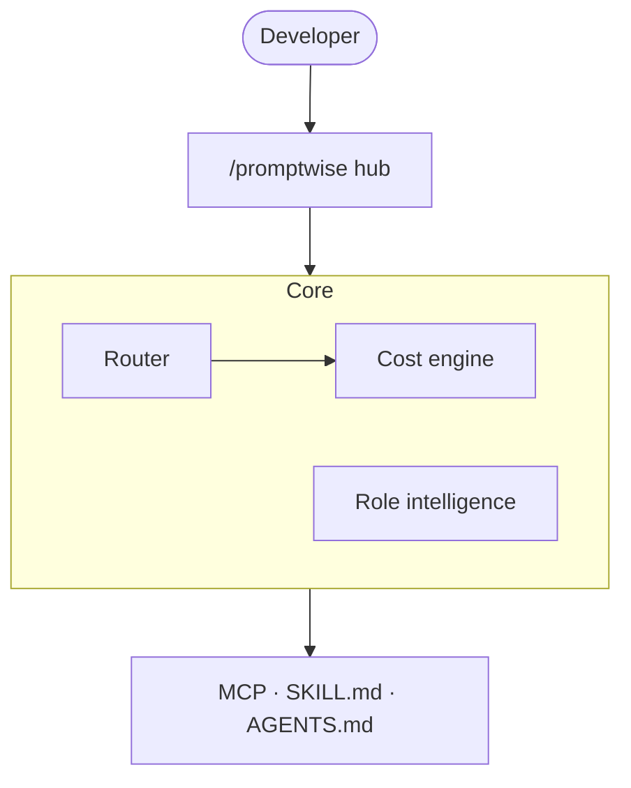

# Architecture Diagram Skill

Produce a clear architecture diagram in **Mermaid** (plain text — renders on GitHub).

1. Determine which **view** is wanted (default to both if unclear):
   - **Functional** — capabilities, actors/users, external systems, data stores. Use a
     `flowchart TB` with subgraphs per capability domain. No code-level detail.
   - **Technical** — modules/packages/classes and their dependencies. Use `flowchart LR`
     or `classDiagram` for class structure.
2. Group related nodes with `subgraph ... end`. Label edges with the relationship
   ("calls", "reads", "emits").
3. Keep node labels short; put detail in edge labels or a legend comment.
4. Output ONLY a fenced ```mermaid block, then a one-line caption. Validate it with the
   `validate_mermaid` tool before presenting.

Example (functional):

