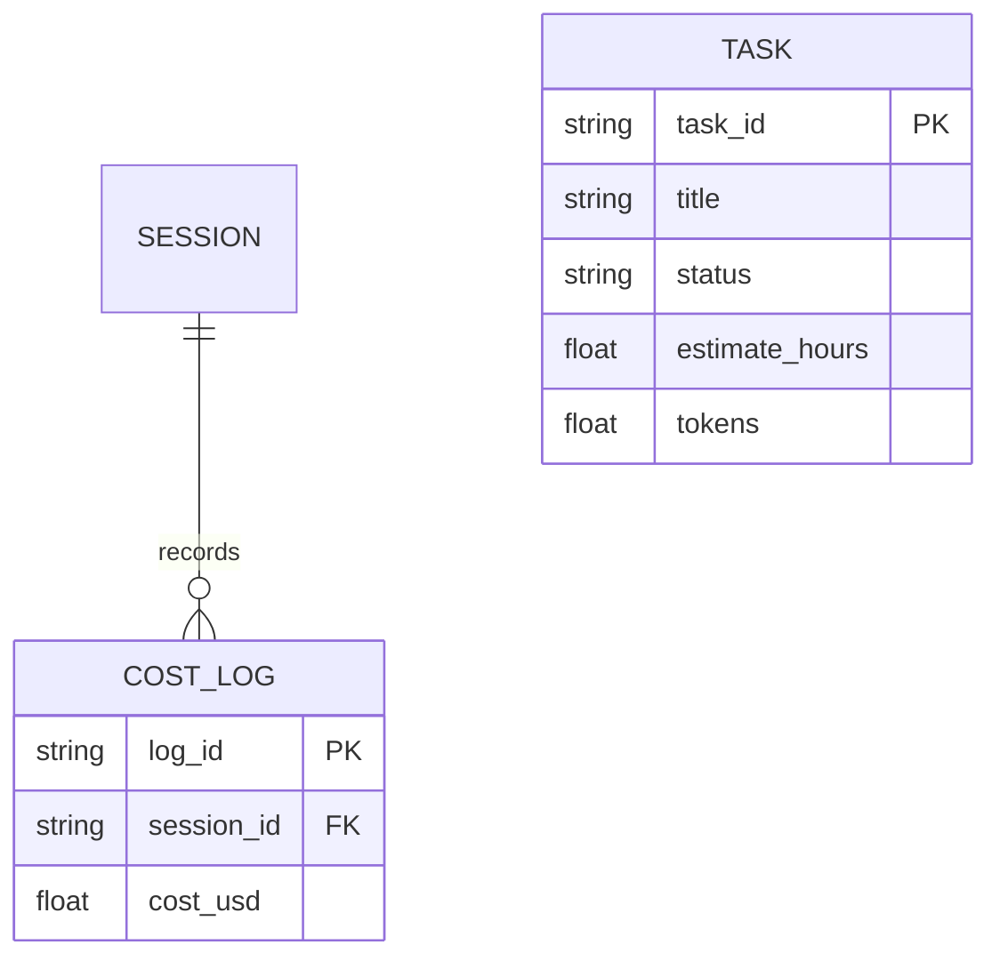

# ER Diagram Skill

Produce a **Mermaid erDiagram** from a schema / ORM models / data description.

1. List entities (tables/models). For each, include key attributes with types and mark
   `PK` / `FK`.
2. Express relationships with cardinality:
   - `||--o{` one-to-many, `||--||` one-to-one, `}o--o{` many-to-many.
   - Label the relationship verb ("places", "contains").
3. Use exact field names/types when a real schema is provided; do not invent columns.
4. Output ONLY a fenced ```mermaid block + a one-line caption. Validate with the
   `validate_mermaid` tool first.

Example:

