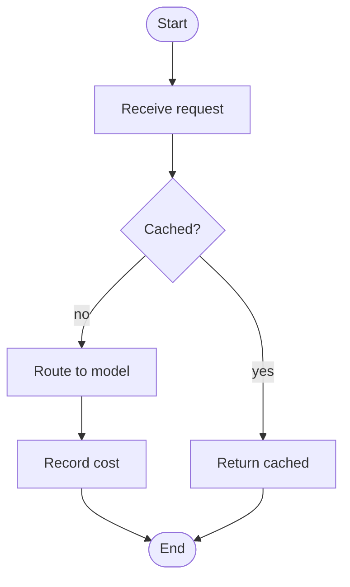

# Flow Diagram Skill

Turn a described process into a **Mermaid flowchart**.

1. Identify start/end, steps, decisions (diamonds), and loops.
2. Use `flowchart TD` (top-down) for processes, `flowchart LR` for pipelines.
3. Decisions: `id{Question?} -->|yes| a` / `-->|no| b`.
4. For multi-actor processes use `subgraph Lane[Actor] ... end` as swimlanes.
5. Keep labels terse; one action per node.
6. Output ONLY a fenced ```mermaid block + a one-line caption. Validate with the
   `validate_mermaid` tool first.

Example:

