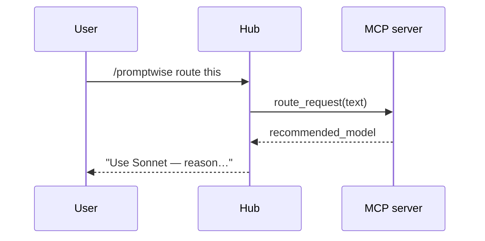

# Sequence Diagram Skill

Produce a **Mermaid sequenceDiagram** of an interaction.

1. Declare participants in call order: `participant U as User`.
2. Messages: `A->>B: request` (solid/sync), `B-->>A: response` (dashed/return).
3. Use `activate`/`deactivate` for lifelines, `loop`/`alt`/`opt`/`par` blocks for control.
4. Keep one message per line; label with the actual method/event.
5. Output ONLY a fenced ```mermaid block + a one-line caption. Validate with the
   `validate_mermaid` tool first.

Example:

