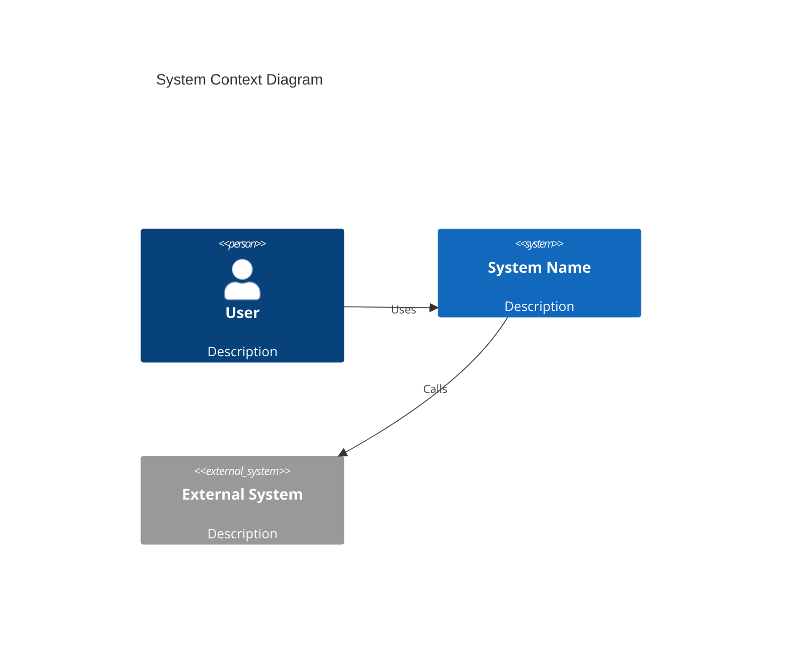
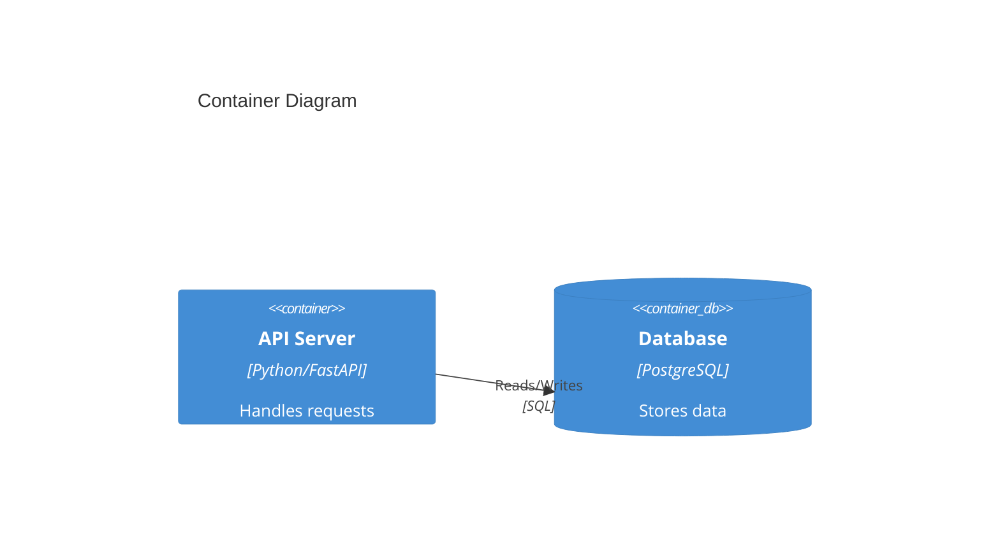

# System Design Documentation

Create system design documentation. Generate: C4 Context → Container → Component diagrams in Mermaid syntax. For each component: {name, type, technology, responsibilities[], interfaces[]}. Include: data flow, scalability considerations, failure modes, ADR references. Output valid Mermaid C4 diagram.

## C4 Diagram Levels

### Level 1 — Context
Shows the system in its environment: users, external systems, and the system itself.



### Level 2 — Container
Shows the major deployable units (web app, API, database, message queue).



### Level 3 — Component
Shows internal components of a single container.

## Component Specification

For each component output:
```json
{
  "name": "ComponentName",
  "type": "service | database | queue | cache | external",
  "technology": "Python/FastAPI",
  "responsibilities": ["responsibility 1", "responsibility 2"],
  "interfaces": ["REST /api/v1/...", "gRPC ServiceName"]
}
```

## Required Sections

1. **Data Flow** — sequence diagram showing primary request flow.
2. **Scalability** — how each component scales (horizontal/vertical), bottlenecks.
3. **Failure Modes** — what happens when each component fails, recovery strategy.
4. **ADR References** — list of architecture decisions that apply (e.g., `ADR-0001-use-postgresql.md`).

## Output

Return `components` array, `mermaid_c4` string (valid Mermaid C4 syntax), and `adr_references` array.
