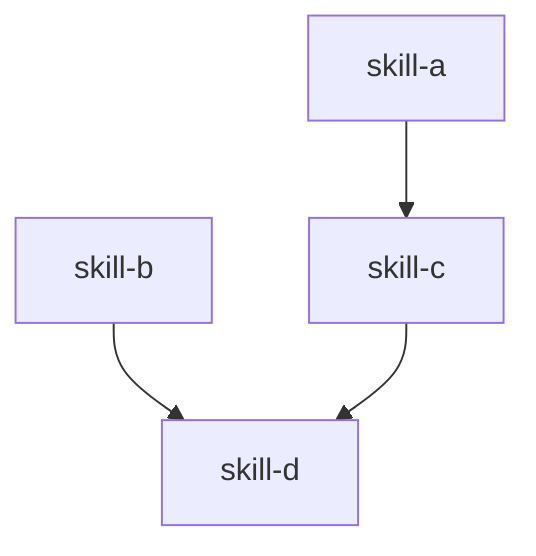

# Agent Chain Designer

Design an optimal skill chain (directed acyclic graph) for a given task.

## Step 1 — Decompose the task

Break the user's task into discrete sub-tasks. Each sub-task should:
- Produce a single, well-defined output
- Be independently testable
- Map to at most one skill

Write a `task_analysis` summary: what the overall goal is and what sub-tasks were identified.

## Step 2 — Map sub-tasks to skills

Call `list_skills` to get the current skill catalog. For each sub-task:
- Match to the best-fit skill by name and triggers
- Note the skill's `model_tier` and `depends_on`
- If no skill exists, flag as a gap (do not invent skills)

## Step 3 — Resolve dependencies

Build the DAG:
- Honor each skill's `depends_on` field — a skill cannot run before its dependencies complete
- Identify skills with no dependencies (can start immediately)
- Identify skills that can run in parallel (no shared dependency path)

## Step 4 — Build the DAG

Represent the chain as an ordered list respecting topological sort. Group parallel skills at the same level.

Example:
```
Level 0 (parallel): [skill-a, skill-b]
Level 1 (depends on a): [skill-c]
Level 2 (depends on b, c): [skill-d]
```

## Step 5 — Generate Mermaid flowchart



## Step 6 — Output skill_chain() call

Produce a ready-to-run Python call to `skill_chain()`:

```python
skill_chain([
    {"skill": "skill-a", "input": {...}},
    {"skill": "skill-b", "input": {...}},
    {"skill": "skill-c", "input": {"data": "{{skill-a.output}}"}},
    {"skill": "skill-d", "input": {"a": "{{skill-b.output}}", "b": "{{skill-c.output}}"}},
])
```

Use `{{skill-name.output}}` template syntax for inter-skill data passing.

## Rules

- Prefer parallel execution for independent skills (better throughput).
- Do not add skills the user did not ask for.
- If a required skill is missing from the catalog, list it in `task_analysis` as a gap and exclude it from the chain.
- Keep chains to 7 steps or fewer where possible; flag if complexity exceeds this.
